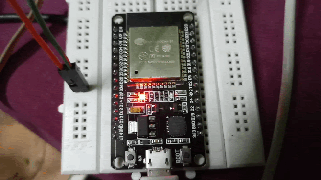

# ESP32 IBM Watson IoT Examples

This is an expanding number of projects by [The Customize Windows](https://thecustomizewindows.com) containing basic examples to advanced examples for WROOM ESP32 with IBM Watson IoT Platform. WROOM ESP32 is like common modern ESP32 boards like Adafruit Feather Huzzah32, DO IT ESP32 v1 & generic. 

---

### `temperature.ino` in action. The blue LED blinking as data uploaded to BlueMix

  

---

### `simple graphing` from IBM IoT platform widget :

  

---

### `PulseSensor/pulse-graphing.ino` in action, it is graphing on IBM IoT platform dashboard widget :

  

---

### Fritzing diagram of `ESP32 multiple relay`

  

### Detect Smartwatch on IBM Watson IoT Widget

  

### Pulse oximetry on IBM Watson IoT Widget

  

---

## List of parts :

1. Follow our [guide to setup WROOM ESP32 dev board on Windows 10](https://thecustomizewindows.com/2019/02/esp-wroom-32-how-to-setup-esp32-nodemcu-with-arduino-ide/)
2. Install PubSubClient library from Arduino IDE
3. Have IBM Cloud account
4. One Wi-Fi hotspot with internet connection
5. One WROOM ESP32 dev board (Like Adafruit Feather Huzzah32, DO IT ESP32)
6. Few LEDs
7. Few jumpers
8. Breadboard

---

## Parts for the advanced examples : 

9. DHT11 sensor for temp, humidity 
10. Pushbutton
11. Pulse sensor for pulse
12. Relay module for control of AC appliances
12. Smartwatch with BLE for detecting presence 
13. MAX30102 module for pulse oximetry 
---

### This is an Free and Open Source Project by Abhishek Ghosh

---

